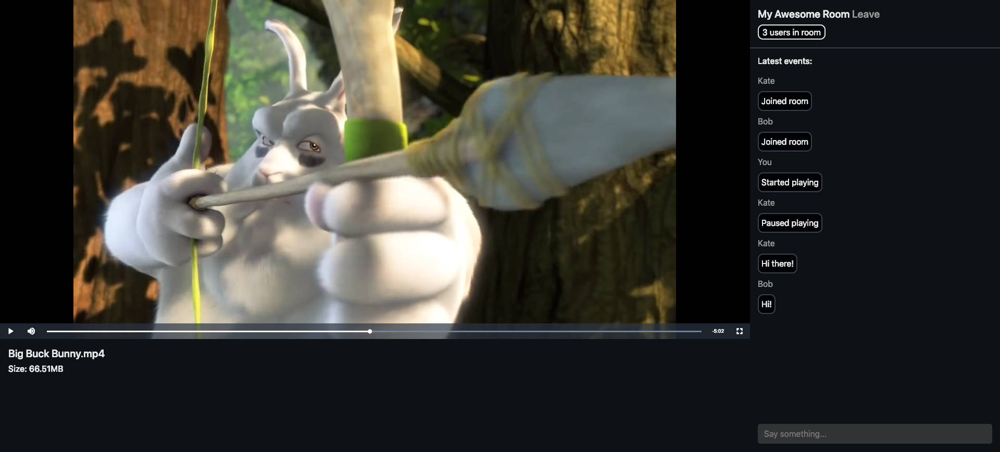
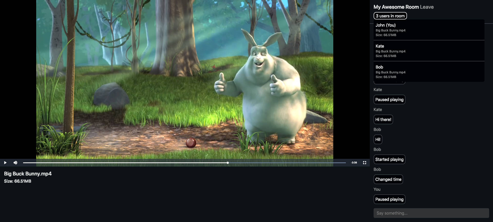

# sync4fun-server
[](https://app.codeship.com/projects/326902)

The very simple implementation of service for watching video content together at the same time. 
There is a server and client part included. The server part can be used separately with any other applications 
that support connection via web sockets.

## Demo






## Setting Up

### Install

* Node.js (v11.11.0 or higher)
* NPM (v6.7.0 or higher)

### Then

```
$ npm install
$ npm start
```

## Tests

```
$ npm test
```

## Build client app

```
$ npm build
```

## Start Webpack in watch mode

```
$ npm watch
```

## Start for development

```
$ npm start-dev
```

## Socket events

You can find more about existing socket events [in separated documentation.](docs/socket_events.md)

## Developed By

Dmitry Kologrivko  - <dmitrykologrivko@gmail.com>